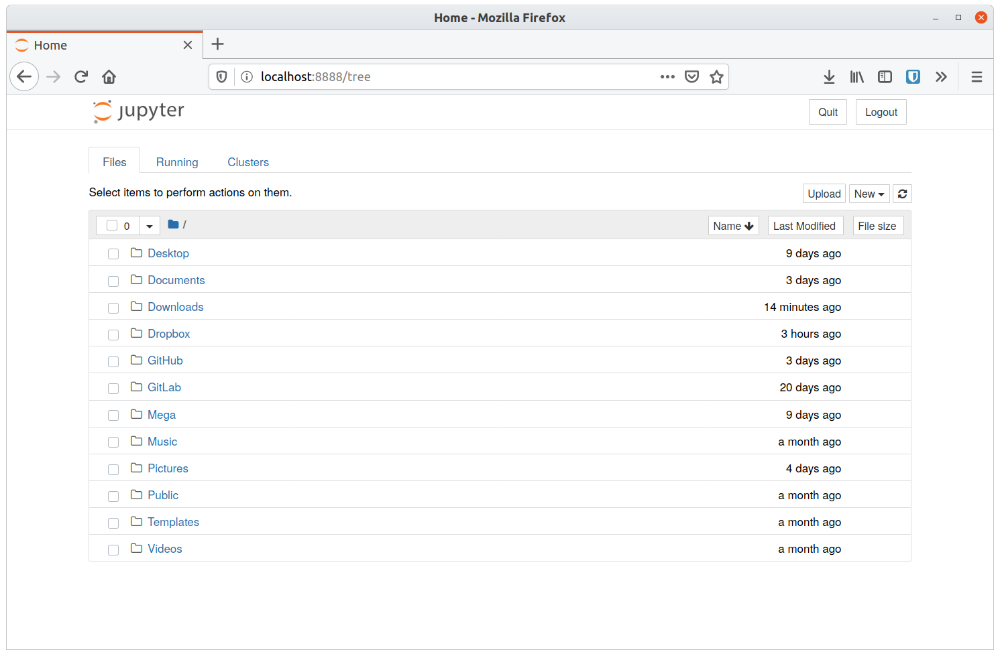
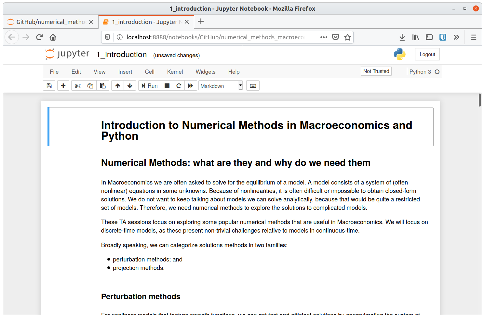
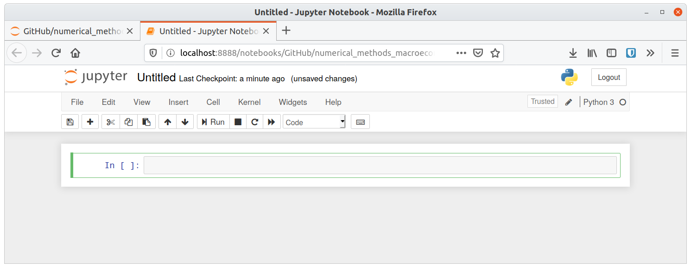

# How to use Jupyter Notebooks

This year I will use Jupyter Notebooks as main interface during our classes.
Using these notebooks will not be obvious at first.
Opening and editing them is not similar to opening a Stata or Matlab window.
Instead, we need to launch the Jupyter session from the terminal.

In brief, instead of opening a window, we launch a program that runs in the background (and in a terminal).
The graphical user interface is instead provided by your own web browser.


## Launching a Jupyter session

Open a terminal.
The application you need to use depends on your Operating System.

- Windows: you can either use the _Command Prompt_ or _PowerShell_.
- macOS: there is an application called _Terminal_.
- Linux: it depends on your distribution, but if you're using Linux, then you know how to open a terminal :-)

In what follows, lines in code listings that start with a dollar sign (`$`) denote prompts at the terminal.
This is the case on Bash, which is normally found both on macOS and Linux.
On Windows, the default prompt is `>` (e.g., `C:\>`).

To launch a Jupyter session, we simply type

```bash
$ jupyter notebook
```

in the terminal (and we obviously press <kbd>Enter</kbd>).
The output will look like the following.

```
[I 15:01:01.720 NotebookApp] Serving notebooks from local directory: /home/andrea
[I 15:01:01.720 NotebookApp] The Jupyter Notebook is running at:
[I 15:01:01.720 NotebookApp] http://localhost:8888/?token=0d6d95750966e08068ca76efbd091bf383f1c1538e35f6f1
[I 15:01:01.720 NotebookApp]  or http://127.0.0.1:8888/?token=0d6d95750966e08068ca76efbd091bf383f1c1538e35f6f1
[I 15:01:01.720 NotebookApp] Use Control-C to stop this server and shut down all kernels (twice to skip confirmation).
[C 15:01:01.767 NotebookApp]

    To access the notebook, open this file in a browser:
        file:///home/andrea/.local/share/jupyter/runtime/nbserver-12162-open.html
    Or copy and paste one of these URLs:
        http://localhost:8888/?token=0d6d95750966e08068ca76efbd091bf383f1c1538e35f6f1
     or http://127.0.0.1:8888/?token=0d6d95750966e08068ca76efbd091bf383f1c1538e35f6f1
```

Leave this terminal window as it is (i.e., do not close it).
You will need it to be open if you want to work on Jupyter Notebooks.
As you work, there will be additional lines printed to the terminal: you should not worry, as those lines simply describe what is happening.

Your default web browser will automatically start (or be brought to the foreground), and it will yield a window like the following.



Although you operate through a web browser, all you see in this window is happening locally on your computer.
This is to say that there are no security concerns at this stage.

Using the interface in your web browser, navigate to the folder containing the notebook you want to open.
Jupyter Notebooks carry the file extension `.ipynb`.

Once you open a notebook, you will be greeted by a screen similar to the following.




## The basics of Jupyter Notebooks

Describing how to work with Jupyter Notebooks is a lengthy task and I am not up to it.
See the [official documentation](https://jupyter-notebook.readthedocs.io/en/stable/index.html).
However, I can provide an overview of the basics.

From the navigation window (the one where you can browse your files) create a new notebook.
It will look like this.



Except from the header and the toolbar, you only see one thing: a _cell_.
There are two main types of cells: _code_ cells and _markdown_ cells.
The former is a place to write your code, so that you can execute it at some point.
The latter instead is a place to write plain text, with the optional formatting offered by the [Markdown syntax](https://daringfireball.net/projects/markdown/basics).
In the ideal scenario, you use markdown cells to write notes about the code, either for your own note-taking or for explaining results (e.g., say you are a data scientist explaining your profit-boosting results to your manager).

On top of having two types of cells, we have two _modes_ of operation: the _command_ mode and the _editing_ mode.
In the former mode, you move around cells and you execute them.
You are in this mode when the thick line on the left of the cell is blue.
In the latter mode, you modify the contents of your cells.
You are in this mode when the thick line on the left of the cell is green.

Each code cell that you can edit has the text `In [ ]:` on its left.
The square brackets will populate with numbers as you execute the code cells.
These numbers only keep track of the order of execution.
When you execute a code cell that is supposed to provide output (either in the form of text or figures), Jupyter will automatically fill the space beneath the cell with the requested output.

If you want to considerably speed up your use of Jupyter Notebooks, you should learn its keyboard shortcuts.
To see them, go to Help -> Keyboard Shortcuts.


## I've heard of Spyder: why are we not using it?

Good question!
[Spyder](https://www.spyder-ide.org/) is a traditional-looking [Integrated Development Environment (IDE)](https://en.wikipedia.org/wiki/Integrated_development_environment) that resembles applications like Matlab and RStudio.

I have four reasons for using notebooks as opposed to show stuff in an IDE.

1. Using Jupyter Notebooks is more pedagogical.
   While I will exclusively use code cells in class, you will have the template of the notebook, so that you can use markdown cells to write your own comments.
   Learning the code of this course may not be trivial in some places.
   Being able to take notes right next to the code is a plus (IMHO).
1. I want to make the point that using terminals is not scary.
   There is some unjustified stigma to using terminals.
   They either look too nerdy or they give a sense of insecurity.
   People are afraid of terminals because using them is not as intuitive as point-and-click interfaces.
   Here I take my small step towards encouraging the use of command-line interfaces.
   Why do I think this is important?
   [You'll be impressed with what you can do in a terminal](https://ux.stackexchange.com/questions/101990) (that you cannot do in a point-and-click interface).
1. We as Economists should stop being dinosaurs when it comes to computing.
   Some people use Scientific Workplace for writing LaTeX documents.
   Some people use Beamer to create their posters for conferences.
   Some people use PowerPoint to create graphs that are then included in their LaTeX documents.
   We are competent people who should use the right tool for the right job.
   Using Jupyter Notebooks allows me to show how we can use web technologies to make our job a bit easier or more exciting (I use notebooks all the time for my research).
   Also consider that, at some point, you will need to come up with a personal website.
   Jupyter Notebooks can easily be embedded in your website, if you want to show off your skills.
1. The choice of IDE is a very personal one.
   Discussion around the question _"What IDE is best for programming language \_\_\_?"_ just goes on indefinitely.
   Spyder may be the first choice (as it has been in the previous two iterations of this course) because it comes together with Anaconda.
   Its interface is familiar to Matlab or RStudio users.
   But Spyder it not the only IDE for Python out there.
   PyCharm and Visual Studio Code are other popular alternatives.
   Linux people may also bring Vim to the table.
   Who am I to choose the IDE for you?

None of these points _alone_ justifies my decision to move to Jupyter Notebooks.
However, all of them combined conviced me.
